# 백엔드 개발 가이드

> 백엔드 개발의 전체 아키텍처부터 핵심 개념까지 체계적으로 정리한 문서입니다.

## 목차

1. [백엔드 개발 개요](#백엔드-개발-개요)
2. [전체 시스템 아키텍처](#전체-시스템-아키텍처)
3. [클라이언트 환경](#클라이언트-환경)
4. [서버 사이드 구성](#서버-사이드-구성)
5. [데이터베이스 시스템](#데이터베이스-시스템)
6. [클라우드 컴퓨팅](#클라우드-컴퓨팅)
7. [백엔드 핵심 기술](#백엔드-핵심-기술)
8. [마이크로서비스 아키텍처](#마이크로서비스-아키텍처)

---

## 백엔드 개발 개요

### 백엔드란?

백엔드는 **서버 사이드 전체**를 의미합니다. 프론트엔드와 통신하면서 비즈니스 로직, 데이터 처리, 인프라 관리 등 서버에서 이루어지는 모든 작업을 포괄합니다.

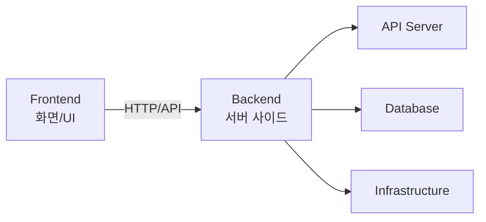

### 프론트엔드 vs 백엔드

| 구분 | 프론트엔드 | 백엔드 |
|------|-----------|--------|
| **역할** | 화면 UI 개발 | 서버 사이드 전체 |
| **주요 작업** | 사용자 인터랙션 | 비즈니스 로직, 데이터 처리 |
| **기술** | React, Vue, Angular | Spring, Node.js, Django |
| **통신 방식** | API 호출 | API 제공, DB 연결 |

### 백엔드 개발자가 알아야 할 것

백엔드 개발자는 단순히 Java, Spring만 아는 것으로는 부족합니다. 전체 시스템 아키텍처를 이해하고 다음을 알아야 합니다:

- ✅ **API 스펙 설계** - RESTful, GraphQL, gRPC
- ✅ **프로토콜** - HTTP, WebSocket, TCP/IP
- ✅ **데이터베이스** - SQL, NoSQL, 캐싱
- ✅ **인프라** - 클라우드, 컨테이너, CI/CD
- ✅ **아키텍처** - 마이크로서비스, 메시지 큐

---

## 전체 시스템 아키텍처

### 시스템 구성도


### 데이터 흐름

1. **클라이언트 요청** → API Gateway
2. **인증/인가** → Auth Service
3. **비즈니스 로직** → API Server
4. **데이터 저장/조회** → Database
5. **로그 기록** → Logging System
6. **분석 처리** → Big Data System

---

## 클라이언트 환경

### 모바일 앱

#### Android
- **개발 언어**: Java, Kotlin
- **프레임워크**: Android SDK
- **통신 방식**: API (REST)

#### iOS
- **개발 언어**: Swift, Objective-C
- **프레임워크**: iOS SDK
- **통신 방식**: API (REST)

### 크로스 플랫폼

| 프레임워크 | 설명 | 특징 |
|----------|------|------|
| **React Native** | React 기반 앱 개발 | 앱 네이티브 컴포넌트 사용 |
| **Flutter** | Dart 언어 사용 | 고성능, 풍부한 UI |
| **Ionic** | 웹 기술 기반 | HTML/CSS/JS |

### 웹 애플리케이션

- **프론트엔드**: React, Vue.js, Angular
- **접속 방식**:
  - **웹 서버**: HTML/CSS/JS 다운로드
  - **API 통신**: 데이터만 주고받음

### 웹 vs API 차이

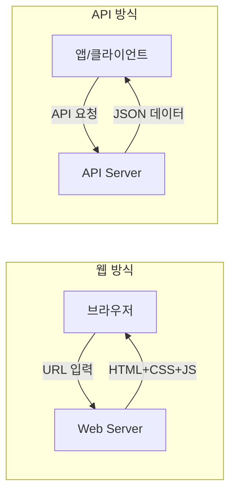

**웹 방식**:
- 화면이 서버에 있음
- HTML/CSS/JS를 다운로드하여 표시
- 예: 브라우저에서 네이버 접속

**API 방식**:
- 화면이 클라이언트에 있음
- 데이터만 주고받음
- 예: 카카오톡 앱에서 메시지 송수신

---

## 서버 사이드 구성

### API Gateway

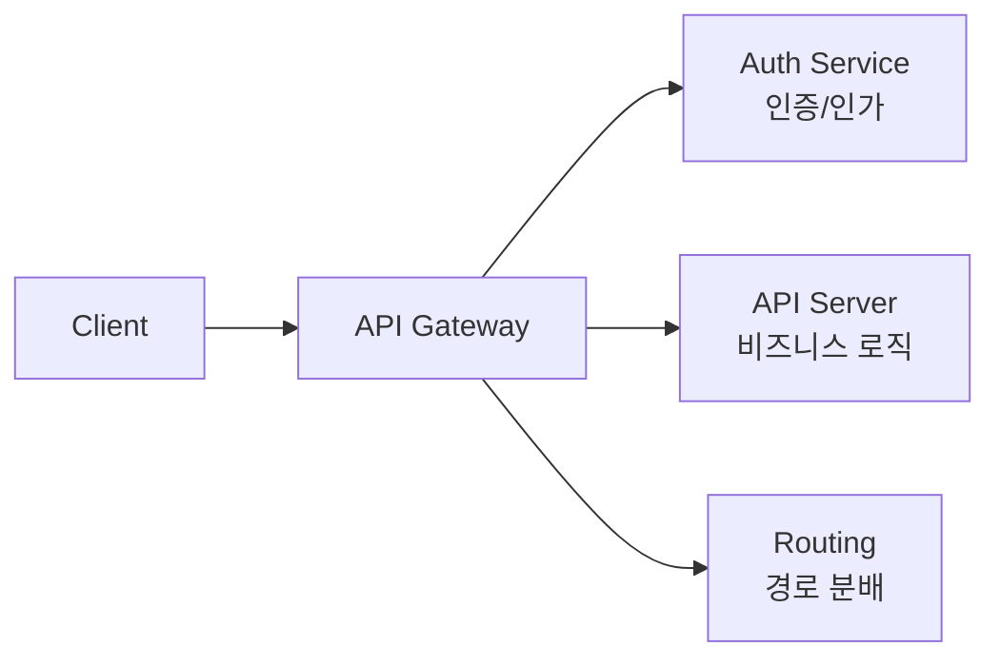

**역할**:
- 인증/인가 처리 (Authentication/Authorization)
- API 라우팅
- Rate Limiting
- 로드 밸런싱

### 인증 vs 인가

| 구분 | Authentication (인증) | Authorization (인가) |
|------|---------------------|-------------------|
| **의미** | 당신이 누구인지 확인 | 무엇을 할 수 있는지 확인 |
| **예시** | 로그인 (ID/PW) | 권한 확인 (관리자/일반) |
| **목적** | 접근 승인 | 접근 범위 제한 |

### API 프로토콜

#### 1. REST API

```http
# 주문 생성
POST /api/orders
Content-Type: application/json

{
  "product_id": 123,
  "quantity": 2
}

# 주문 조회
GET /api/orders/456

# 주문 수정
PUT /api/orders/456

# 주문 삭제
DELETE /api/orders/456
```

**특징**:
- HTTP 메서드 활용 (GET, POST, PUT, DELETE)
- URL 경로로 리소스 표현
- JSON 형식 주로 사용

#### 2. GraphQL

```graphql
# 단일 요청으로 필요한 데이터만 조회
query {
  user(id: "123") {
    name
    email
    orders {
      id
      total
    }
  }
}
```

**특징**:
- 모든 요청을 `/graphql`로 전송
- 클라이언트가 필요한 필드만 선택
- Over-fetching/Under-fetching 해결

#### 3. gRPC

```protobuf
// Protocol Buffers 정의
service OrderService {
  rpc CreateOrder (OrderRequest) returns (OrderResponse);
  rpc GetOrderHistory (UserRequest) returns (OrderList);
}
```

**특징**:
- 상세한 URL 경로 사용
- Protocol Buffers 사용
- 고성능 바이너리 통신

### API Server 구성

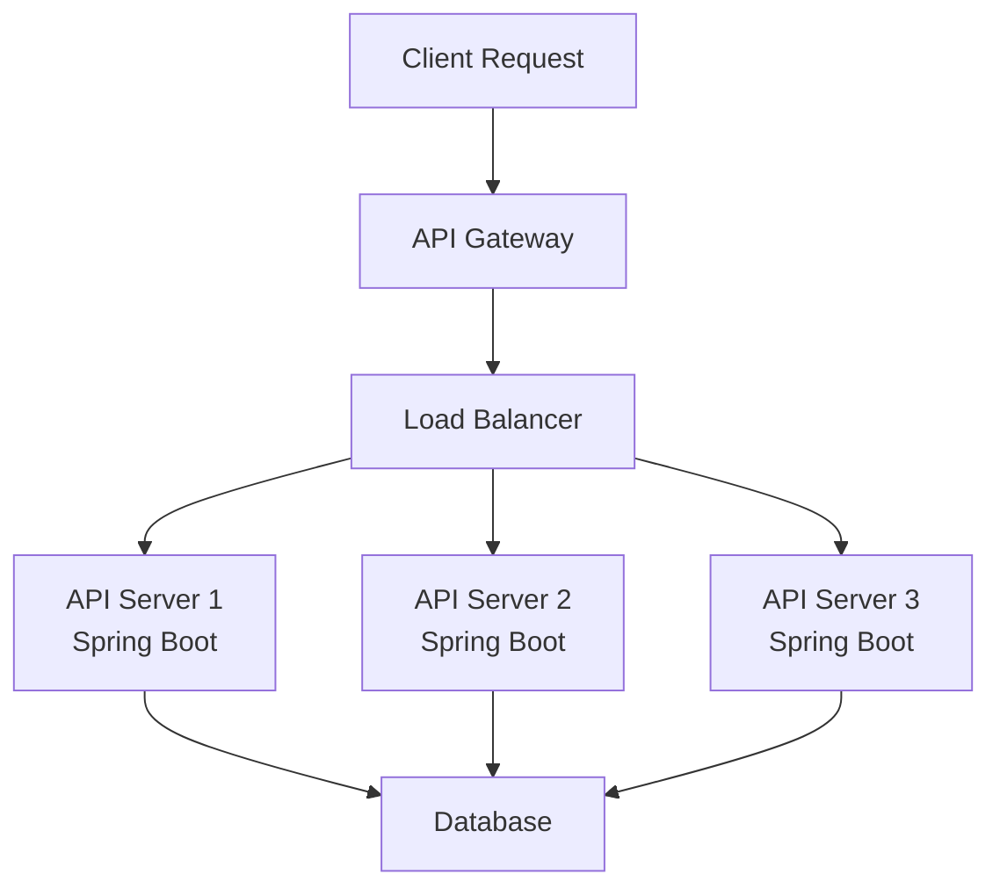

**주요 프레임워크**:

| 언어 | 프레임워크 | 특징 |
|------|----------|------|
| Java | Spring Boot | 엔터프라이즈급, DI/AOP |
| JavaScript | Express.js | 가볍고 빠름 |
| Python | Django, FastAPI | 빠른 개발, ML 통합 |
| Go | Gin, Echo | 고성능, 동시성 |

### 동기 vs 비동기

#### 🍔 햄버거 가게로 이해하기

**동기 방식 (Synchronous) = 카운터 주문**
```
👤 손님: "햄버거 하나 주세요"
      ↓
👨‍🍳 직원: "네, 만들어드릴게요" (손님은 카운터에서 대기...)
      ↓ (3분 소요)
👨‍🍳 직원: "여기 있습니다!"
      ↓
👤 손님: (드디어 받음) "감사합니다"
```
- **특징**: 손님이 계속 기다려야 함
- **장점**: 간단하고 확실함
- **단점**: 시간 낭비, 다른 일 못함

**비동기 방식 (Asynchronous) = 진동벨 시스템**
```
👤 손님: "햄버거 하나 주세요"
      ↓
👨‍🍳 직원: "네, 진동벨 받으시고 앉아계세요"
      ↓
👤 손님: (자리로 가서 스마트폰 봄, 친구와 대화...)
      ↓ (3분 후)
📳 진동벨: "띠리링~" (알림)
      ↓
👤 손님: "아, 햄버거 나왔네!" (가서 받음)
```
- **특징**: 기다리는 동안 다른 일 가능
- **장점**: 시간 효율적, 여러 작업 동시 처리
- **단점**: 구현이 복잡함

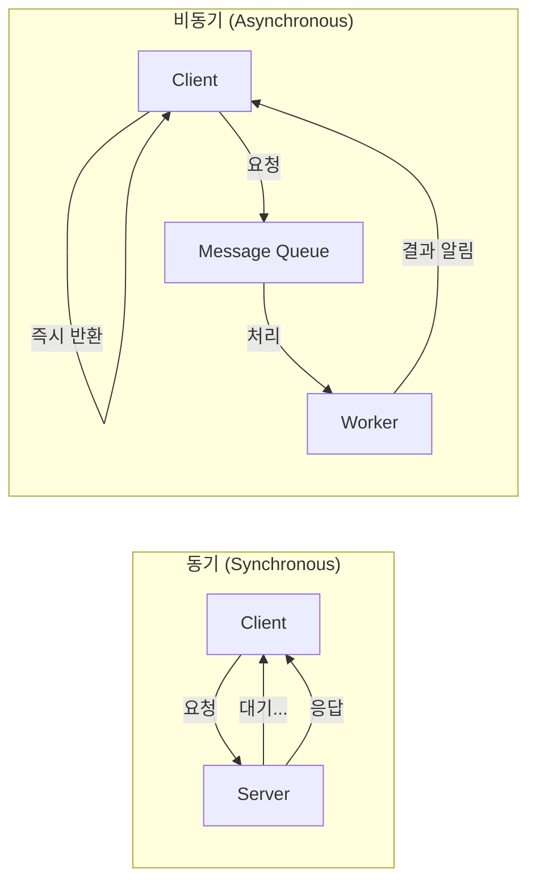

**실제 사용 예시**:

| 방식 | 사용 케이스 | 이유 |
|------|------------|------|
| **동기** | 로그인, 결제 | 즉시 결과 필요 |
| **비동기** | 이메일 발송, 동영상 변환 | 오래 걸리는 작업 |

---

## 메시지 큐 (Message Queue)

### 📬 우체국 시스템으로 이해하기

**문제 상황: 직접 배달의 어려움**
```
👨‍💼 발신자 → (직접 찾아가서 전달) → 👩‍💼 수신자
```
- 수신자가 자리에 없으면? → 계속 기다려야 함 😰
- 수신자가 100명이면? → 100명 다 찾아다녀야 함 😱
- 발신자가 다른 일을 해야 한다면? → 일을 못함 😓

**해결책: 우체국(메시지 큐) 활용**
```
👨‍💼 발신자 → 📮 우체통(Message Queue) → 🚚 우체부들 → 👥 수신자들
```

**동작 원리:**
```
1. 📝 발신자가 편지 작성 (메시지 생성)
   ↓
2. 📮 우체통에 투입 (Queue에 저장)
   ↓
3. 👨‍💼 발신자는 다른 일 하러 감 (비동기!)
   ↓
4. 🚚 우체부가 편지 수거 (Consumer가 처리)
   ↓
5. 👩‍💼 수신자에게 배달 (작업 완료)
```

**핵심 장점:**

| 장점 | 비유 | 설명 |
|------|------|------|
| **비동기 처리** | 우체통에 넣고 바로 감 | 응답 기다릴 필요 없음 |
| **부하 분산** | 우체부 여러 명 | 많은 메시지도 처리 가능 |
| **느슨한 결합** | 발신자와 수신자 모름 | 서비스 독립적 운영 |
| **메시지 보관** | 우체국 보관함 | 처리 실패해도 재시도 가능 |

### 개념

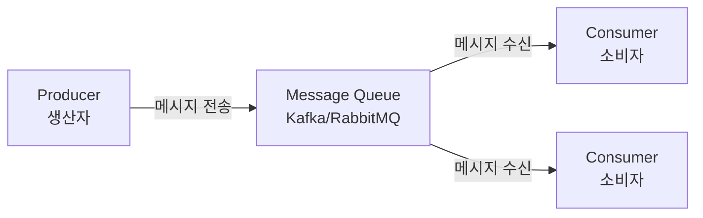

### 실제 사용 예시

#### 🛒 온라인 쇼핑몰 주문 처리

**메시지 큐 없이 (동기 방식)**
```
사용자 → [주문] → [결제 처리 5초] → [재고 확인 3초] → [배송 예약 2초] → [이메일 발송 1초]
총 11초 대기... 😰
```

**메시지 큐 사용 (비동기 방식)**
```
사용자 → [주문] → 큐에 저장 → "주문 완료!" (0.1초)
                      ↓
            [백그라운드 처리]
            ├─ 결제 서비스 (5초)
            ├─ 재고 서비스 (3초)
            ├─ 배송 서비스 (2초)
            └─ 알림 서비스 (1초)
```

**실제 코드 예시:**
```python
# 주문 생성 (Producer)
@app.post("/orders")
async def create_order(order: Order):
    # 1. 주문 정보를 Kafka에 전송
    kafka_producer.send("order-topic", order.dict())

    # 2. 즉시 응답 (비동기!)
    return {"status": "주문 접수", "order_id": order.id}

# 결제 처리 (Consumer)
@kafka_consumer("order-topic")
async def process_payment(order_data):
    # 결제 처리 로직...
    payment_result = payment_service.charge(order_data)

    # 다음 단계로 메시지 전송
    kafka_producer.send("payment-complete", payment_result)
```

### 주요 제품

**Kafka vs RabbitMQ 비교**

| 특징 | Kafka | RabbitMQ |
|------|-------|----------|
| **비유** | 🚄 고속열차 (대량 운송) | 🚐 택배차 (정확한 배달) |
| **용도** | 대용량 스트리밍 | 작업 큐, 메시지 보장 |
| **속도** | 초고속 (100만 msg/s) | 빠름 (수만 msg/s) |
| **보관** | 디스크에 영구 저장 | 메모리 (일시적) |
| **사용처** | 로그, 이벤트, 실시간 분석 | 작업 처리, 알림 |

**선택 기준:**
- **Kafka**: "엄청 많은 데이터를 빠르게 처리해야 해!" → 로그 수집, 실시간 분석
- **RabbitMQ**: "정확하게 전달되는게 중요해!" → 주문 처리, 이메일 발송
- **AWS SQS**: "관리가 편한게 좋아!" → AWS 환경, 간단한 큐

### MSA에서의 역할

#### 🏪 마이크로서비스 아키텍처 예시

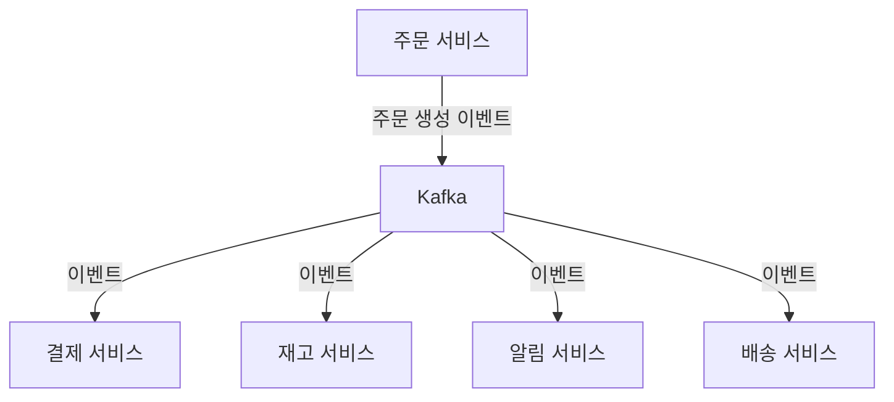

**작동 흐름:**
```
1. 👤 사용자가 "주문하기" 클릭
   ↓
2. 📦 주문 서비스: "주문 생성됨!" 이벤트 발행
   ↓
3. 📮 Kafka: 이벤트 저장
   ↓
4. 각 서비스가 이벤트 수신 및 처리
   💳 결제 서비스: "결제 진행할게요!"
   📊 재고 서비스: "재고 차감할게요!"
   📧 알림 서비스: "고객에게 알림 보낼게요!"
   🚚 배송 서비스: "배송 준비할게요!"
```

**핵심 장점:**
- ✅ 서비스 하나 죽어도 다른 서비스 정상 작동
- ✅ 새로운 서비스 추가 쉬움 (큐만 구독하면 됨)
- ✅ 트래픽 급증해도 큐가 버퍼 역할

---

## 로깅과 모니터링

### 📹 CCTV 시스템으로 이해하기

**문제: 서버에서 무슨 일이 일어나는지 모름**
```
😰 "어? 서버가 갑자기 느려졌네?"
😱 "아까 에러가 났는데 뭐였더라?"
😓 "누가 언제 무슨 API를 호출했지?"
```

**해결: 로깅 시스템 (= 건물의 CCTV)**
```
🏢 건물(서버)
├─ 📹 CCTV 카메라 = 로그 생성
├─ 💾 녹화 서버 = 로그 저장 (Elasticsearch)
├─ 🖥️ 관제실 모니터 = 시각화 (Kibana)
└─ 🔍 영상 검색 = 로그 검색
```

### ELK Stack 이해하기

#### 🎬 영화 제작으로 비유하기

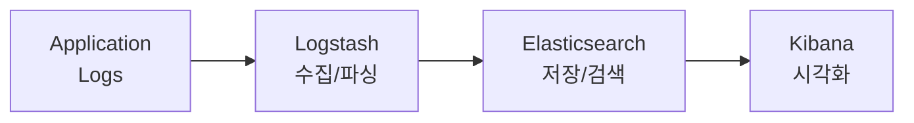

**1. 📹 촬영 (로그 생성)**
```python
# 애플리케이션에서 로그 남기기
logger.info("사용자 user123이 로그인했습니다")
logger.error("결제 API 호출 실패: 타임아웃")
logger.warning("메모리 사용량 80% 초과")
```

**2. 🎬 편집 (Logstash - 수집/파싱)**
```
원본 로그: "2024-01-20 14:30:00 ERROR 결제 API 호출 실패"
         ↓ (파싱)
구조화된 데이터:
{
  "timestamp": "2024-01-20T14:30:00",
  "level": "ERROR",
  "message": "결제 API 호출 실패",
  "service": "payment-service"
}
```

**3. 🗄️ 보관 (Elasticsearch - 저장)**
```
수백만 개의 로그를 빠르게 검색 가능
- "최근 1시간 동안 에러 몇 개?"
- "user123이 호출한 API는?"
- "결제 실패 로그만 보여줘"
→ 0.1초 만에 검색! ⚡
```

**4. 📊 상영 (Kibana - 시각화)**
```
대시보드에서 한눈에 파악:
📈 시간대별 에러 발생 추이
📊 API별 호출 횟수
🗺️ 지역별 접속 통계
⚠️ 실시간 알림 (에러 급증 시)
```

### 구성 요소

| 컴포넌트 | 역할 | 비유 |
|----------|------|------|
| **Elasticsearch** | 로그 저장 및 검색 | 🗄️ 스마트 보관함 (빠른 검색) |
| **Logstash** | 로그 수집 및 파싱 | 🎬 영상 편집기 (데이터 정제) |
| **Kibana** | 시각화 대시보드 | 📺 모니터링 TV (한눈에 파악) |

### 실제 사용 예시

#### 🚨 장애 상황 대응

**시나리오: 새벽 3시, 결제 API 장애 발생**

**ELK 없이 (악몽)**
```
😱 "로그 파일 어디있지?"
😓 "텍스트 에디터로 하나씩 검색..."
😰 "100만 줄 로그 중에 어딨지?"
⏰ 2시간 소요...
```

**ELK 있을 때 (천국)**
```
1. 📱 알림: "결제 API 에러 급증!"
2. 🖥️ Kibana 접속
3. 🔍 검색: "level:ERROR AND service:payment"
4. 📊 그래프: "아, 3시부터 급증했네!"
5. 📝 상세 로그: "외부 PG사 타임아웃 발생"
⏰ 5분 만에 원인 파악! ✨
```

**Kibana 대시보드 예시:**
```
┌─────────────────────────────────────────┐
│  🔴 실시간 에러 모니터링                 │
├─────────────────────────────────────────┤
│  📈 시간대별 API 호출 수                 │
│  ████████████░░░░ 14:00-15:00          │
│  ████████░░░░░░░░ 15:00-16:00 ⚠️       │
│                                         │
│  🔝 TOP 5 에러 메시지                   │
│  1. "DB connection timeout" (1,234건)  │
│  2. "Payment gateway error" (567건)   │
│  3. "Invalid user token" (234건)      │
│                                         │
│  🗺️ 지역별 트래픽                       │
│  서울: 45% | 부산: 20% | 기타: 35%     │
└─────────────────────────────────────────┘
```

### 용도

**1. 에러 추적**
- 어떤 에러가 언제 어디서 발생했는지 즉시 파악
- 에러 발생 패턴 분석

**2. 성능 분석**
- API 응답 시간 모니터링
- 느린 쿼리 찾기

**3. 사용자 행동 분석**
- 어떤 기능을 많이 쓰는지
- 사용자 여정 추적

**4. 보안 모니터링**
- 비정상적인 접근 탐지
- API 남용 감지

---

## 데이터베이스 시스템

### SQL vs NoSQL

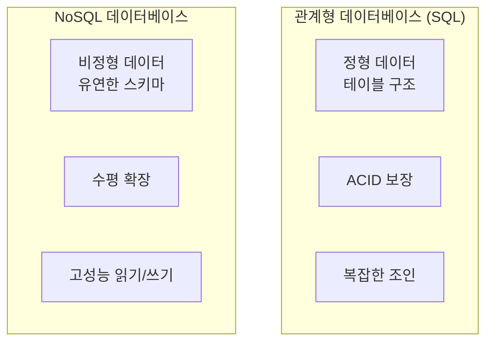

### SQL 데이터베이스

**특징**:
- 정형 데이터, 테이블 구조
- 관계 (JOIN)를 통한 데이터 연결
- ACID 트랜잭션 보장
- 복잡한 쿼리 가능

**주요 제품**:
- **MySQL**: 오픈소스, 웹 서비스
- **PostgreSQL**: 고급 기능, 확장성
- **Oracle**: 엔터프라이즈급

**사용 예시**:
```sql
-- 회원 테이블
CREATE TABLE users (
  id INT PRIMARY KEY,
  name VARCHAR(100),
  email VARCHAR(100),
  dept_id INT,
  FOREIGN KEY (dept_id) REFERENCES departments(id)
);

-- 부서 테이블
CREATE TABLE departments (
  id INT PRIMARY KEY,
  dept_name VARCHAR(100)
);

-- 조인 쿼리
SELECT u.name, d.dept_name
FROM users u
JOIN departments d ON u.dept_id = d.id;
```

### NoSQL 데이터베이스

**특징**:
- 비정형 데이터, 유연한 스키마
- 서비스에 필요한 데이터를 한 곳에 저장
- 수평 확장 용이
- 빠른 읽기/쓰기

**주요 제품**:

| 유형 | 제품 | 특징 |
|------|------|------|
| Document | MongoDB | JSON 형식, 유연한 스키마 |
| Key-Value | Redis | 초고속 캐싱 |
| Column | Cassandra | 대용량 분산 처리 |
| Graph | Neo4j | 관계 데이터 특화 |

**사용 예시**:
```javascript
// MongoDB - Document Store
{
  "_id": "user123",
  "name": "홍길동",
  "email": "hong@example.com",
  "department": {
    "id": "dept001",
    "name": "개발팀"
  },
  "skills": ["Java", "Spring", "React"],
  "projects": [
    { "id": "proj1", "name": "프로젝트A" }
  ]
}
```

### 파일 스토리지

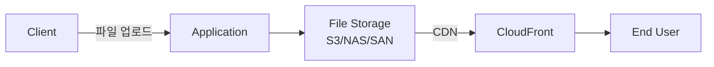

**주요 제품**:
- **AWS S3**: 클라우드 객체 스토리지
- **NAS**: 네트워크 파일 스토리지
- **SAN**: 블록 스토리지

**용도**:
- 이미지, 동영상 저장
- 백업 데이터 보관
- 정적 파일 서빙

---

## 클라우드 컴퓨팅

### 🏢 사무실 vs 🏨 호텔로 이해하기

**전통적 방식 (사무실 구매)**
```
🏢 사무실 구매 = 서버 직접 구매
├─ 💰 초기 투자: 10억원 (건물 매입)
├─ 🔨 설치: 3개월 소요
├─ 👷 유지보수: 직원 고용 필요
├─ 📈 확장: 건물 더 사야 함
└─ ❌ 문제: 돈도 많이 들고 시간도 오래 걸림
```

**클라우드 방식 (호텔 대여)**
```
🏨 호텔 대여 = 클라우드 사용
├─ 💰 초기 투자: 0원 (필요한 만큼만 결제)
├─ ⚡ 설치: 즉시 사용 (클릭 한 번!)
├─ 👨‍💼 유지보수: 호텔이 알아서
├─ 📈 확장: 방 더 빌리면 됨
└─ ✅ 장점: 빠르고 저렴하고 편함!
```

### 클라우드 개념

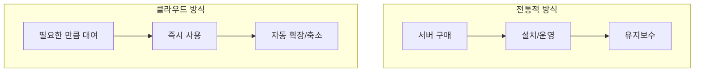

**실제 비교:**

| 항목 | 전통적 방식 | 클라우드 방식 |
|------|-----------|-------------|
| **초기 비용** | 수억~수백억원 | 거의 0원 |
| **시작 시간** | 수개월 | 몇 분 |
| **확장** | 서버 추가 구매 (몇 주) | 클릭 한 번 (몇 초) |
| **유지보수** | 직접 관리 (인력 필요) | 클라우드가 알아서 |
| **비용 구조** | 고정 비용 | 사용량 기반 |

**장점**:
- ✅ **초기 투자 0원**: 작은 스타트업도 시작 가능
- ✅ **탄력적 확장**: 트래픽 증가하면 자동으로 서버 추가
- ✅ **사용한 만큼만 비용**: 밤에는 서버 줄여서 비용 절감
- ✅ **글로벌 인프라**: 전세계 어디서든 빠른 서비스

### 주요 클라우드 서비스

| 제공사 | 서비스명 | 특징 |
|--------|---------|------|
| Amazon | AWS | 가장 많은 서비스, 선도적 |
| Microsoft | Azure | 엔터프라이즈 친화적 |
| Google | GCP | ML/빅데이터 강점 |
| Naver | NCP | 국내 서비스 최적화 |

### IaaS, PaaS, SaaS

#### 🍕 피자 만들기로 이해하기

**집에서 직접 만들기 (On-Premise)**
```
🏠 집에서 모든 걸 직접:
├─ 🔥 오븐 사기
├─ 🍅 재료 사기
├─ 👨‍🍳 피자 만들기
├─ 🧹 청소하기
└─ 💰 비용: 많이 듦, ⏰ 시간: 오래 걸림
```

**IaaS = 🏠 주방만 빌리기**
```
🏨 호텔 주방 대여 (EC2, GCE):
├─ ✅ 오븐 제공됨 (서버)
├─ 🍅 재료는 직접 사기 (OS 설치)
├─ 👨‍🍳 피자는 직접 만들기 (앱 설치)
├─ 🧹 청소는 직접 (관리 필요)
└─ 💡 "주방은 빌리고, 나머지는 내가"
```

**PaaS = 🍕 토핑만 선택하기**
```
🍕 피자 가게 방문 (Heroku, Cloud Run):
├─ ✅ 오븐 있음 (서버)
├─ ✅ 재료 있음 (OS, 런타임)
├─ 🍕 토핑만 고르기 (코드만 올리기)
├─ ✅ 가게가 알아서 구워줌 (자동 배포)
└─ 💡 "코드만 주면 나머지는 알아서"
```

**SaaS = 🚚 배달 시키기**
```
📱 배달앱 주문 (Gmail, Twilio):
├─ ✅ 완성된 피자 배달 (완제품 서비스)
├─ 🖱️ 클릭만 하면 됨 (API 호출)
├─ ❌ 요리 안해도 됨 (설치 불필요)
└─ 💡 "그냥 쓰기만 하면 됨"
```

### 비교표

| 항목 | On-Premise | IaaS | PaaS | SaaS |
|------|-----------|------|------|------|
| **비유** | 집에서 요리 | 주방 대여 | 피자집 방문 | 배달 시킴 |
| **서버 관리** | 직접 | 직접 | 자동 | 자동 |
| **OS 설치** | 직접 | 직접 | 자동 | 자동 |
| **코드 배포** | 직접 | 직접 | 직접 | ❌ |
| **난이도** | 😰😰😰 | 😰😰 | 😊 | 😎 |
| **자유도** | 100% | 80% | 50% | 10% |
| **관리 부담** | 최대 | 많음 | 적음 | 거의 없음 |

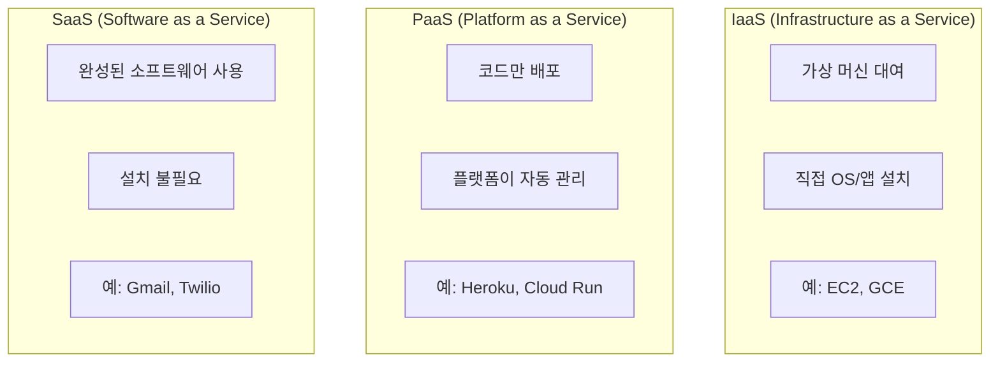

#### IaaS (Infrastructure as a Service)

**개념**: 가상 머신(서버)을 빌려서 직접 관리

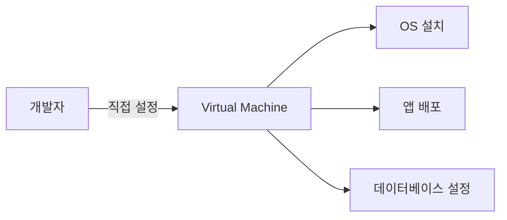

**실제 예시:**
```bash
# AWS EC2 사용 시
1. ☁️ EC2 인스턴스 생성 (서버 대여)
2. 💻 Ubuntu 설치 (OS 선택)
3. 📦 Node.js 설치 (런타임 설치)
4. 🚀 애플리케이션 배포
5. 🔧 Nginx 설정 (웹서버 설정)
→ 자유도는 높지만 관리할 게 많음
```

**예시**:
- **AWS EC2**: 가상 서버 대여
- **Google Compute Engine**: 구글 가상 서버
- **Azure Virtual Machines**: MS 가상 서버

#### PaaS (Platform as a Service)

**개념**: 코드만 올리면 플랫폼이 자동으로 관리

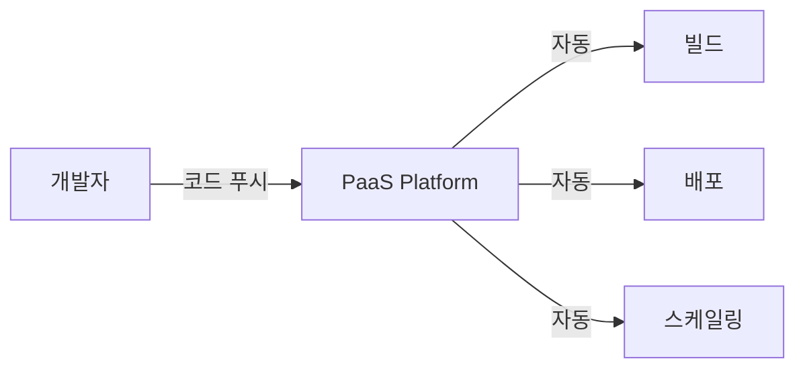

**실제 예시:**
```bash
# Heroku 사용 시
1. 📝 코드 작성
2. 🚀 git push heroku main (그냥 푸시!)
3. ✨ 자동으로 빌드, 배포, 실행
→ 간편하지만 자유도는 낮음
```

**예시**:
- **Heroku**: 코드만 푸시하면 끝
- **Google Cloud Run**: 컨테이너 자동 배포
- **AWS Elastic Beanstalk**: AWS의 PaaS

#### SaaS (Software as a Service)

**개념**: 완성된 소프트웨어를 API로 사용

**실제 예시:**
```python
# Twilio로 SMS 발송 (SaaS)
from twilio.rest import Client

client = Client(account_sid, auth_token)
message = client.messages.create(
    to="+821012345678",
    from_="+15017250604",
    body="Hello from Twilio!"
)
# 설치, 관리 필요 없음. API 호출만 하면 됨!
```

**예시**:
- **Twilio**: 이메일/SMS 발송
- **Channel Talk**: 고객 채팅 상담
- **Stripe**: 결제 처리
- **SendGrid**: 이메일 발송
- **Firebase**: 백엔드 서비스

**선택 가이드:**

| 상황 | 추천 | 이유 |
|------|------|------|
| 완전한 제어 필요 | IaaS | 모든 걸 커스터마이징 가능 |
| 빠른 개발/배포 | PaaS | 인프라 신경 안써도 됨 |
| 특정 기능 필요 | SaaS | 개발 시간 절약 |
| 스타트업 | PaaS/SaaS | 비용과 시간 절약 |

### Auto Scaling

#### 🍽️ 레스토랑 좌석 조절로 이해하기

**문제 상황: 고정된 서버 = 고정된 좌석**

```
📅 평일 점심:
🪑🪑🪑 (3개 테이블)
👤👤 (손님 2명) → 괜찮음 ✅

📅 주말 저녁:
🪑🪑🪑 (여전히 3개 테이블)
👥👥👥👥👥👥 (손님 20명) → 대기 시간 30분! 😱
```

**해결책: Auto Scaling = 자동 테이블 추가**

```
📅 평일 점심:
🪑🪑🪑 (3개)
👤👤 (손님 2명)
💰 비용: 3개분

📅 주말 저녁 (자동 감지):
🪑🪑🪑🪑🪑🪑🪑🪑🪑🪑 (10개로 자동 증설!)
👥👥👥👥👥👥 (손님 20명) → 대기 없음! ✅
💰 비용: 10개분 (필요한 시간만)

📅 저녁 후:
🪑🪑🪑 (3개로 자동 축소)
💰 비용: 다시 3개분
```

#### 🏗️ 실제 AWS Auto Scaling 예시

**설정 예시**:
```yaml
# Auto Scaling 정책
최소 서버: 2대
최대 서버: 10대

조건:
  - CPU 사용률 > 70% → 서버 2대 추가
  - CPU 사용률 < 30% → 서버 1대 제거
```

**비용 비교**:
| 시나리오 | 고정 서버 (10대) | Auto Scaling |
|---------|-----------------|--------------|
| 평상시 (20시간) | 💰 10대 × 20시간 = 200시간 | 💰 2대 × 20시간 = 40시간 |
| 피크 시간 (4시간) | 💰 10대 × 4시간 = 40시간 | 💰 10대 × 4시간 = 40시간 |
| **총 비용** | **240시간** | **80시간 (66% 절감!)** |

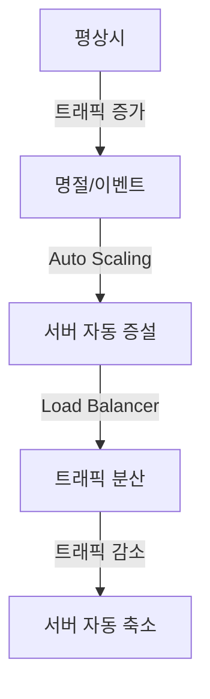

**동작 원리**:
1. 트래픽 모니터링 (CloudWatch 같은 도구 사용)
2. 임계치 초과 시 서버 자동 추가 (설정한 조건에 따라)
3. 로드 밸런서가 요청 분배 (새 서버로 트래픽 분산)
4. 트래픽 감소 시 서버 제거 (비용 절감)

**비용 효율**:
- ✅ 필요할 때만 서버 증설 (탄력적 운영)
- ✅ 사용한 만큼만 비용 지불 (종량제)
- ✅ 명절 후 불필요한 서버 유지 비용 절감 (자동 축소)

---

## CI/CD (지속적 통합/배포)

### 🏭 자동차 공장으로 이해하기

#### 전통적 방식 (수동 배포) 😰

```
👨‍💻 개발자 A: 코드 작성 완료!
        ↓
👨‍💻 개발자 B: 내 코드도 완료!
        ↓
🤝 통합: "어? 두 코드가 충돌하네?" → 3시간 디버깅 😱
        ↓
🧪 테스트: 수동으로 하나하나 클릭... → 2시간 소요
        ↓
📦 배포: 서버 접속해서 파일 복사 → 1시간
        ↓
🚨 "어? 서버에서 안 돌아가네?" → 롤백 30분
        ↓
총 소요 시간: 6시간 30분! 😫
```

#### CI/CD 방식 (자동화) 🚀

```
👨‍💻 개발자: git push (코드 업로드)
        ↓
🤖 CI 로봇:
   ├─ ✅ 다른 코드와 자동 통합
   ├─ ✅ 자동 빌드 (5분)
   ├─ ✅ 자동 테스트 1000개 실행 (10분)
   └─ ✅ 테스트 통과!
        ↓
🤖 CD 로봇:
   ├─ ✅ 자동으로 서버 배포
   ├─ ✅ 무중단 배포 (사용자는 모름)
   └─ ✅ 문제 발생 시 자동 롤백
        ↓
총 소요 시간: 15분! (26배 빠름) 🎉
```

### 개념

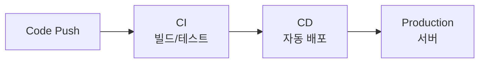

**CI (Continuous Integration)** = 🏭 **자동 조립 라인**:
- 코드 통합 자동화 (여러 개발자 코드 자동 병합)
- 빌드, 테스트 자동 실행 (로봇이 자동으로 품질 검사)
- 빠른 피드백 (문제 발견 시 즉시 알림)

**CD (Continuous Deployment)** = 🚚 **자동 배송 시스템**:
- 배포 자동화 (버튼 하나로 전세계 서버에 배포)
- 서버에 코드 자동 전달 (사람 개입 없이)
- 무중단 배포 (사용자는 서비스 중단을 느끼지 못함)

### 빌드 vs 컴파일 vs 배포

| 용어 | 의미 | 예시 |
|------|------|------|
| **컴파일** | 소스 코드를 기계어로 변환 | .java → .class |
| **빌드** | 실행 가능한 파일로 묶음 | .jar, .war 생성 |
| **배포** | 서버에 코드 전달 및 실행 | 서버에 .jar 복사 |

### 주요 도구

- **Jenkins**: 가장 많이 사용, 플러그인 풍부
- **GitHub Actions**: GitHub 통합, 간편한 설정
- **GitLab CI/CD**: GitLab 통합
- **CircleCI**: 클라우드 기반

---

## 백엔드 핵심 기술

### Primary Database

**용도**: 웹사이트의 주요 데이터 저장

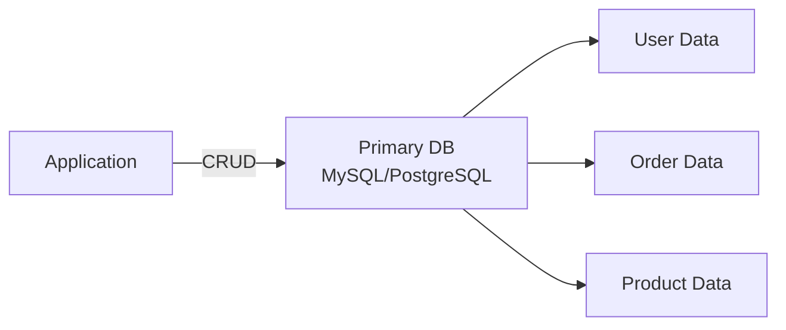

### Cache (캐싱)

#### 📚 책상 vs 서랍장으로 이해하기

**문제 상황: DB만 사용 = 매번 서랍장까지 가기**

```
👨‍💼 상황: 자주 보는 문서 찾기

없이 (DB만 사용):
📄 문서 필요 → 🚶‍♂️ 복도 끝 서랍장까지 걸어감 (3초)
              → 🔍 서랍 뒤적여 찾기 (2초)
              → 🚶‍♂️ 다시 책상으로 (3초)

총 시간: 8초 × 100번 = 800초 (13분!) 😱
```

**해결책: 캐시 사용 = 책상 위에 자주 쓰는 문서 놔두기**

```
👨‍💼 캐시 전략:

1️⃣ 첫 번째 요청:
   📄 문서 필요 → 🚶‍♂️ 서랍장 (8초)
                → 📋 책상에 복사본 둠 (캐시 저장)

2️⃣ 두 번째 요청부터:
   📄 문서 필요 → 👀 책상 바로 확인 (0.1초!)

총 시간: 8초 + (0.1초 × 99번) = 18초 (44배 빠름!) 🚀
```

#### 🏪 실제 예시: 쇼핑몰 베스트 상품

**캐시 없이**:
```python
# 매번 DB 조회 (느림)
def get_best_products():
    products = db.query("SELECT * FROM products ORDER BY sales DESC LIMIT 10")
    # 실행 시간: 500ms (0.5초)
    return products

# 1000명 접속 시:
# 500ms × 1000 = 500초 (8분) 😱
```

**캐시 사용**:
```python
import redis
cache = redis.Redis()

def get_best_products():
    # 1. 먼저 캐시 확인
    cached = cache.get("best_products")
    if cached:
        return cached  # 실행 시간: 5ms (0.005초)

    # 2. 캐시에 없으면 DB 조회
    products = db.query("SELECT * FROM products ORDER BY sales DESC LIMIT 10")

    # 3. 캐시에 저장 (10분간 유지)
    cache.setex("best_products", 600, products)

    return products

# 1000명 접속 시:
# 500ms (첫 요청) + (5ms × 999) = 5초 (100배 빠름!) 🎉
```

**개념**: 자주 사용하는 데이터를 빠르게 조회

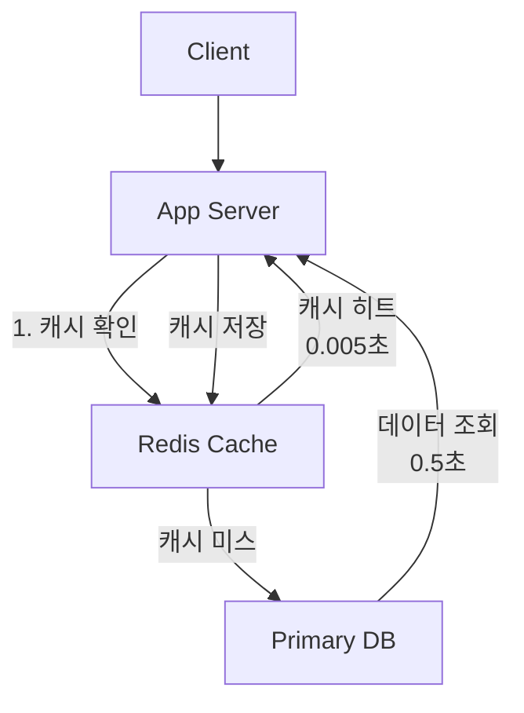

**주요 제품**:
- **Redis**: 인메모리 (RAM에 저장), 초고속 (0.005초)
- **Memcached**: 간단한 키-값 저장, 가볍고 빠름

**캐시 적용 대상**:
| 데이터 종류 | 캐시 적용 | 이유 |
|-----------|---------|------|
| 베스트 상품 | ✅ 적합 | 모든 사용자가 동일하게 봄 |
| 인기 검색어 | ✅ 적합 | 자주 조회되고 변경 적음 |
| 사용자 장바구니 | ⚠️ 주의 | 사용자별로 다름 (세션 캐시 사용) |
| 실시간 주식 가격 | ❌ 부적합 | 초단위 변경 (캐시 무의미) |

### Search Database

**용도**: 빠른 텍스트 검색

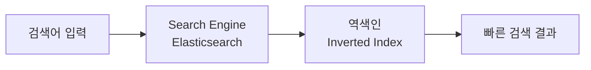

**주요 제품**:
- **Elasticsearch**: 전문 검색, 로그 분석

### Blob Storage & CDN

#### 📦 물류 창고 시스템으로 이해하기

**문제 상황: 중앙 창고만 사용**

```
🏢 서울 본사 서버 (유일한 창고)

🇰🇷 서울 사용자:
   📱 이미지 요청 → 🏢 서울 서버 (10km)
   → ⚡ 0.1초 다운로드 ✅

🇺🇸 뉴욕 사용자:
   📱 이미지 요청 → 🛫 태평양 건너 서울 서버 (11,000km)
   → 🐌 5초 다운로드 😱

🇧🇷 브라질 사용자:
   📱 이미지 요청 → 🛫🛫 지구 반대편 서울 서버 (18,000km)
   → 🐢 10초 다운로드 💀
```

**해결책: CDN = 전세계 물류 센터**

```
🌍 CDN (Content Delivery Network):

🏢 서울 본사 (원본 저장소)
   ↓ (복사본 배포)
📦 서울 CDN 서버
📦 뉴욕 CDN 서버
📦 런던 CDN 서버
📦 도쿄 CDN 서버
📦 상파울루 CDN 서버

🇰🇷 서울 사용자:
   📱 이미지 요청 → 📦 서울 CDN (10km)
   → ⚡ 0.1초 ✅

🇺🇸 뉴욕 사용자:
   📱 이미지 요청 → 📦 뉴욕 CDN (5km)
   → ⚡ 0.1초 ✅

🇧🇷 브라질 사용자:
   📱 이미지 요청 → 📦 상파울루 CDN (3km)
   → ⚡ 0.1초 ✅
```

#### 🏪 실제 예시: Netflix

**CDN 없이** (불가능):
```
🎬 한국에서 영화 시청:
서울 → 미국 Netflix 서버 (11,000km)
→ 버퍼링 지옥 😱

💰 비용: 태평양 해저 케이블 사용료 폭탄
```

**CDN 사용** (현재 방식):
```
🎬 한국에서 영화 시청:
서울 → 서울 CDN 서버 (10km)
→ 4K 영화 즉시 재생 🎉

💰 비용: 로컬 네트워크만 사용 (95% 절감!)

📊 Netflix CDN 배포:
├─ 🇰🇷 한국: 20개 서버
├─ 🇺🇸 미국: 100개 서버
├─ 🇯🇵 일본: 30개 서버
└─ 🌍 전세계: 1000개+ 서버
```

**용도**: 이미지, 동영상 등 대용량 파일

```mermaid
graph LR
    A[User Upload] --> B[Application]
    B --> C[S3<br/>Blob Storage<br/>원본 저장]
    C --> D[CloudFront<br/>CDN<br/>전세계 배포]
    D --> E[🌏 전세계 사용자<br/>0.1초 이내]
```

**이유**:
- Primary DB는 파일 저장에 부적합 (텍스트 데이터 전용)
- CDN을 통한 빠른 전송 (사용자와 가까운 서버 활용)
- 대역폭 비용 절감 (원본 서버 부하 감소)

**속도 비교**:
| 거리 | CDN 없이 | CDN 사용 | 개선 |
|------|---------|---------|------|
| 서울→서울 | 0.1초 | 0.1초 | 동일 |
| 뉴욕→서울 | 5초 | 0.1초 | **50배** 🚀 |
| 브라질→서울 | 10초 | 0.1초 | **100배** 🚀 |

### Analytical Database

**용도**: 데이터 분석, BI

```mermaid
graph TB
    A[Primary DB] -->|ETL| B[Data Warehouse<br/>Snowflake/BigQuery]
    C[Log Data] --> B
    D[External Data] --> B
    B --> E[Data Analysis<br/>BI Tools]
```

**주요 제품**:
- **Snowflake**: 클라우드 데이터 웨어하우스
- **Google BigQuery**: 빅데이터 분석

**이유**:
- Primary DB는 서비스 운영에 집중
- 분석 쿼리는 별도 DB 사용

---

## 빅데이터 처리

### Hadoop 에코시스템

```mermaid
graph TB
    A[Data Sources] --> B[Hadoop HDFS<br/>분산 저장]
    B --> C[MapReduce<br/>분산 처리]
    B --> D[Spark<br/>고속 처리]
    B --> E[Hive<br/>SQL 인터페이스]
    C --> F[Analysis Results]
    D --> F
    E --> F
```

**구성 요소**:
- **Hadoop**: 분산 파일 시스템 (HDFS)
- **Spark**: 고속 분산 처리
- **Hive**: SQL 인터페이스
- **HBase**: NoSQL 데이터베이스

**AWS EMR**:
- AWS의 관리형 Hadoop 서비스
- 빅데이터 처리 자동화

---

## 마이크로서비스 아키텍처

### 🏬 백화점 vs 🏪 전문점으로 이해하기

#### Monolithic (모놀리식) = 🏬 종합 백화점

```
🏢 거대한 단일 건물 (하나의 거대한 코드)

문제점:
❌ 화장품 코너 공사 → 전체 백화점 휴업 😱
   (작은 기능 수정 → 전체 시스템 재배포)

❌ 의류 부서만 바쁨 → 전체 건물 증축? 😰
   (특정 기능만 부하 → 전체 서버 증설)

❌ 식품은 Python이 좋은데 의류팀이 Java 고집 😤
   (부서별 최적 기술 선택 불가)

❌ 한 부서 화재 → 전체 건물 위험! 🔥
   (한 기능 오류 → 전체 시스템 다운)
```

#### Microservices (마이크로서비스) = 🏪 전문 매장

```
🏙️ 여러 개의 독립 매장 (작고 독립적인 서비스들)

🏪 의류 전문점 (주문 서비스)
   ├─ 자체 창고 (MySQL)
   ├─ 자체 직원 (Node.js)
   └─ 독립 운영

💄 화장품 전문점 (결제 서비스)
   ├─ 자체 창고 (MongoDB)
   ├─ 자체 직원 (Python)
   └─ 독립 운영

👤 고객센터 (사용자 서비스)
   ├─ 자체 시스템 (PostgreSQL)
   ├─ 자체 직원 (Java)
   └─ 독립 운영

장점:
✅ 화장품 매장 리모델링 → 다른 매장 정상 영업 👍
   (결제 서비스 업데이트 → 주문 서비스 무중단)

✅ 의류점만 매장 확장 → 비용 효율적 💰
   (주문 서비스만 서버 증설)

✅ 각 매장이 최적 시스템 선택 🎯
   (결제는 Python, 주문은 Java)

✅ 한 매장 문제 → 다른 매장 정상 영업 ✅
   (결제 오류 → 주문/조회는 정상)
```

### Monolithic vs Microservices

```mermaid
graph TB
    subgraph Monolithic["모놀리식 🏬"]
        M1[단일 코드베이스<br/>모든 기능 포함<br/>하나의 DB]
    end

    subgraph Microservices["마이크로서비스 🏪"]
        MS1[주문 서비스<br/>Node.js + MySQL]
        MS2[결제 서비스<br/>Python + MongoDB]
        MS3[사용자 서비스<br/>Java + PostgreSQL]
        MS4[알림 서비스<br/>Go + Redis]
    end
```

### 마이크로서비스 장점

✅ **독립적인 배포** (= 각 매장 독립 리모델링)
- 각 서비스를 개별 배포
- 전체 시스템 중단 없이 업데이트
- 예: 결제 서비스만 새 버전 배포

✅ **기술 스택 자유** (= 각 매장 자유로운 인테리어)
- 서비스별 최적 언어/DB 선택
- 예: 결제는 Python, 주문은 Java, 알림은 Go

✅ **확장성** (= 인기 매장만 확장)
- 필요한 서비스만 확장
- 리소스 효율적 사용
- 예: 주문 서비스 서버 10대, 결제 서비스 3대

✅ **팀 분리** (= 각 매장 독립 팀)
- 서비스별 독립 팀 운영
- 빠른 개발 속도
- 팀 간 의존성 최소화

### 마이크로서비스 구성 예시

```mermaid
graph TB
    A[API Gateway] --> B[주문 서비스]
    A --> C[결제 서비스]
    A --> D[사용자 서비스]
    A --> E[알림 서비스]

    B --> F[MySQL]
    C --> G[MongoDB]
    D --> H[PostgreSQL]
    E --> I[Redis]

    B -->|이벤트| J[Kafka]
    C -->|이벤트| J
    J --> E
```

**서비스 간 통신**:
- **동기**: REST API, gRPC
- **비동기**: 메시지 큐 (Kafka)

---

## 백엔드 개발 로드맵

### 1단계: 기초

```mermaid
graph LR
    A[프로그래밍 언어<br/>Java/Python/JS] --> B[웹 기초<br/>HTTP/REST]
    B --> C[데이터베이스<br/>SQL]
    C --> D[API 개발<br/>Spring/Express]
```

### 2단계: 심화

```mermaid
graph LR
    A[프레임워크<br/>Spring Boot] --> B[ORM<br/>JPA/Hibernate]
    B --> C[인증/인가<br/>JWT/OAuth]
    C --> D[테스트<br/>Unit/Integration]
```

### 3단계: 아키텍처

```mermaid
graph LR
    A[디자인 패턴] --> B[마이크로서비스]
    B --> C[메시지 큐<br/>Kafka]
    C --> D[클라우드<br/>AWS/GCP]
```

### 4단계: 인프라

```mermaid
graph LR
    A[Docker<br/>컨테이너화] --> B[Kubernetes<br/>오케스트레이션]
    B --> C[CI/CD<br/>자동화]
    C --> D[모니터링<br/>ELK/Grafana]
```

---

## Senior MHealth 프로젝트 아키텍처

### 시스템 구성

```mermaid
graph TB
    subgraph Frontend["프론트엔드"]
        A1[Next.js Web App<br/>Vercel]
    end

    subgraph Backend["백엔드 서비스"]
        B1[API Service<br/>FastAPI]
        B2[AI Service<br/>Vertex AI/Gemini]
    end

    subgraph Database["데이터 저장소"]
        C1[Cloud SQL<br/>MySQL]
        C2[BigQuery<br/>분석]
        C3[Firebase Storage<br/>음성 파일]
    end

    subgraph Cloud["GCP 인프라"]
        D1[Cloud Run<br/>서버리스]
        D2[Cloud Storage<br/>파일]
        D3[Vertex AI<br/>ML]
    end

    A1 -->|API 호출| B1
    A1 -->|AI 분석| B2
    B1 --> C1
    B2 --> C1
    B1 --> C2
    B2 --> D3
    B1 --> C3
    B2 --> C3
```

### 기술 스택 정리

| 계층 | 기술 | 역할 |
|------|------|------|
| **Frontend** | Next.js | 웹 애플리케이션 |
| **API Server** | FastAPI (Python) | 사용자 관리 API |
| **AI Server** | FastAPI + Vertex AI | 음성 분석 AI |
| **Database** | Cloud SQL (MySQL) | 관계형 데이터 |
| **Analytics** | BigQuery | 데이터 분석 |
| **Storage** | Firebase Storage | 파일 저장 |
| **Hosting** | Vercel + Cloud Run | 배포 플랫폼 |

---

## AI Service API 상세 가이드

### 🔗 User-API-Endpoint-함수 연결 관계

#### 전체 흐름도

```mermaid
graph TB
    subgraph "👤 User Layer (사용자)"
        U1[🌐 웹 브라우저]
        U2[📱 모바일 앱]
        U3[🖥️ 관리자 대시보드]
    end

    subgraph "🌐 API Layer (main.py)"
        E1[GET /<br/>health_check 함수]
        E2[GET /health<br/>detailed_health 함수]
        E3[POST /analyze<br/>analyze_text 함수]
        E4[POST /transcribe<br/>transcribe_audio 함수]
        E5[POST /analyze-audio<br/>analyze_audio 함수]
    end

    subgraph "🔧 Service Layer (services/*.py)"
        S1[🎤 stt_service<br/>speech_to_text.py]
        S2[🧠 analyzer<br/>vertex_ai_analyzer.py]
    end

    subgraph "☁️ External APIs (Google Cloud)"
        G1[🎤 Speech-to-Text API]
        G2[🤖 Vertex AI Gemini]
    end

    U1 --> E1
    U1 --> E2
    U2 --> E3
    U2 --> E4
    U3 --> E5

    E1 -.->|상태 체크| E1
    E2 -.->|환경 변수 확인| E2
    E3 --> S2
    E4 --> S1
    E5 --> S1
    E5 --> S2

    S1 --> G1
    S2 --> G2

    style E1 fill:#e1f5fe
    style E2 fill:#e1f5fe
    style E3 fill:#f3e5f5
    style E4 fill:#fff3e0
    style E5 fill:#e8f5e9
```

#### 🎯 엔드포인트별 상세 연결

**1️⃣ 헬스체크 엔드포인트**
```
👤 사용자
    ↓ HTTP GET /
📡 main.py:health_check()
    ↓ 직접 응답 (함수 내부 처리)
📦 {"status": "healthy", "service": "...", "version": "..."}
```

**2️⃣ 상세 헬스체크**
```
👤 사용자
    ↓ HTTP GET /health
📡 main.py:detailed_health()
    ↓ os.getenv() 로 환경 변수 확인
📦 {"status": "healthy", "components": {...}, "environment": {...}}
```

**3️⃣ 텍스트 분석**
```
👤 사용자
    ↓ HTTP POST /analyze
    ↓ {"text": "우울해요...", "user_id": "user123"}
📡 main.py:analyze_text(request: AnalysisRequest)
    ↓ 입력 검증
    ↓ analyzer.analyze_mental_health(request)
🧠 vertex_ai_analyzer.py:analyze_mental_health()
    ↓ Gemini API 호출
☁️ Vertex AI Gemini
    ↓ AI 분석 결과
📦 {"depression_score": 75, "anxiety_score": 60, ...}
```

**4️⃣ 음성 → 텍스트 변환**
```
👤 사용자
    ↓ HTTP POST /transcribe
    ↓ multipart/form-data (audio file)
📡 main.py:transcribe_audio(file, user_id, language_code)
    ↓ 파일 검증
    ↓ stt_service.transcribe_audio(audio_content, filename, audio_request)
🎤 speech_to_text.py:transcribe_audio()
    ↓ Google STT API 호출
☁️ Google Speech-to-Text
    ↓ 음성 인식 결과
📦 {"transcript": "안녕하세요...", "confidence": 0.92, ...}
```

**5️⃣ 통합 음성 분석 (핵심!)**
```
👤 사용자
    ↓ HTTP POST /analyze-audio
    ↓ multipart/form-data (audio file)
📡 main.py:analyze_audio(file, user_id, language_code)
    ↓
    ├─ 🎬 1막: 음성 인식
    │   ↓ stt_service.transcribe_audio()
    │   🎤 speech_to_text.py
    │   ↓ Google STT API
    │   ☁️ Speech-to-Text
    │   ↓ "우울해요..." (텍스트 결과)
    │
    └─ 🎬 2막: AI 분석
        ↓ analyzer.analyze_mental_health()
        🧠 vertex_ai_analyzer.py
        ↓ Vertex AI Gemini
        ☁️ Gemini API
        ↓ AI 분석 결과
📦 {"depression_score": 75, "transcript": "우울해요...", ...}
```

#### 📂 코드 파일 매핑

```
User Request
    ↓
┌─────────────────────────────────────────┐
│  📄 app/main.py (API Layer)             │
│  ├─ health_check()         → Line 50   │
│  ├─ detailed_health()      → Line 60   │
│  ├─ analyze_text()         → Line 100  │
│  ├─ transcribe_audio()     → Line 120  │
│  └─ analyze_audio()        → Line 150  │
└─────────────────────────────────────────┘
    ↓
┌─────────────────────────────────────────┐
│  📄 app/services/ (Service Layer)       │
│  ├─ speech_to_text.py                  │
│  │  ├─ validate_audio_file()           │
│  │  └─ transcribe_audio()              │
│  │                                      │
│  └─ vertex_ai_analyzer.py               │
│     ├─ initialize()                     │
│     └─ analyze_mental_health()          │
└─────────────────────────────────────────┘
    ↓
┌─────────────────────────────────────────┐
│  ☁️ Google Cloud Services               │
│  ├─ Speech-to-Text API                  │
│  └─ Vertex AI (Gemini)                  │
└─────────────────────────────────────────┘
```

#### 🔄 데이터 흐름 요약

| Layer | 역할 | 파일 | 주요 함수 |
|-------|------|------|----------|
| **User** | 요청 발생 | 브라우저/앱 | - |
| **API** | 요청 접수 및 라우팅 | `main.py` | `analyze_text()`, `analyze_audio()` |
| **Service** | 비즈니스 로직 처리 | `services/*.py` | `transcribe_audio()`, `analyze_mental_health()` |
| **External** | 실제 AI/ML 수행 | Google Cloud | STT API, Vertex AI |

**핵심 원칙**:
- 🎯 **API Layer**: "무엇을" 할지 결정 (라우팅, 검증)
- 🔧 **Service Layer**: "어떻게" 할지 구현 (비즈니스 로직)
- ☁️ **External APIs**: 실제 AI 기술 제공

### API 기본 개념

#### API란?
**API (Application Programming Interface)**는 서로 다른 소프트웨어가 소통하는 방법을 정의한 규칙입니다.

**카페 주문 시스템으로 이해하기:**
```
👤 고객        📋 메뉴판        👨‍🍳 바리스타        ☕ 커피머신
  │              │                │                │
  │── "아메리카노" ──►│── 주문서 ──►│── 커피 제조 ──►│
  │              │                │                │
  │◄── 커피 전달 ────│◄── 완성품 ───│◄── 커피 완성 ───│
```

**웹 API로 바꿔보면:**
```
🌐 웹 브라우저   📡 API 엔드포인트   🖥️ 서버        🤖 AI 서비스
     │              │                │                │
     │── HTTP 요청 ──►│── 데이터 처리 ──►│── AI 분석 ──►│
     │              │                │                │
     │◄── JSON 응답 ──│◄── 결과 반환 ────│◄── 분석 완료 ──│
```

**핵심**: API는 **"주문서"** 역할! 정확한 형식으로 요청하면 원하는 결과를 받을 수 있습니다.

#### REST API
**REST**는 웹에서 정보를 주고받는 규칙입니다.

**카페 메뉴판으로 이해하기:**
```
📋 HTTP 메서드 = 주문 방식
┌─────────────────────────────────────────┐
│ GET    /menu     → 📖 "메뉴 보여주세요"    │
│ POST   /order    → ✏️  "주문할게요"       │
│ PUT    /order/1  → 🔄 "주문 변경해주세요"  │
│ DELETE /order/1  → ❌ "주문 취소해주세요"  │
└─────────────────────────────────────────┘
```

**AI 서비스로 바꿔보면:**
```
📡 엔드포인트 = 서비스 메뉴
┌─────────────────────────────────────────────┐
│ GET    /health        → 🏥 "서버 상태 확인"   │
│ POST   /analyze       → 📝 "텍스트 분석해줘"  │
│ POST   /transcribe    → 🎤 "음성을 글로 바꿔줘" │
│ POST   /analyze-audio → 🧠 "음성 분석해줘"   │
└─────────────────────────────────────────────┘
```

### AI Service 프로젝트 구조

```
backend/ai-service/
├── app/
│   ├── main.py                     # 🌐 API 엔드포인트 (컨트롤러)
│   └── services/
│       ├── speech_to_text.py       # 🎤 음성 인식 서비스
│       └── vertex_ai_analyzer.py   # 🧠 AI 분석 서비스
├── requirements.txt                # 📦 필요한 패키지 목록
├── Dockerfile                      # 🐳 Docker 설정
└── README.md                       # 📖 프로젝트 설명
```

#### 계층 구조
**회사 조직도로 이해하기:**

```
🏢 Senior MHealth AI Service 회사 조직도
┌─────────────────────────────────────────────────────────┐
│                    🎯 API Layer                         │
│                   (접수처 - main.py)                    │
│  "고객 요청을 받고, 적절한 부서로 연결하고, 결과를 전달"     │
│                                                         │
│  👨‍💼 직원: FastAPI                                      │
│  📋 업무: HTTP 요청 받기 → 검증 → 부서 연결 → 응답 생성    │
└─────────────────────────────────────────────────────────┘
                            ⬇️
┌─────────────────────────────────────────────────────────┐
│                 🔧 Service Layer                        │
│              (실무 부서 - services/*.py)                 │
│           "실제 일을 처리하는 전문가들"                    │
│                                                         │
│  🎤 STT팀: speech_to_text.py                           │
│  🧠 AI팀: vertex_ai_analyzer.py                        │
│  📋 업무: 음성 인식, AI 분석, 데이터 처리                 │
└─────────────────────────────────────────────────────────┘
                            ⬇️
┌─────────────────────────────────────────────────────────┐
│                🌐 External APIs                         │
│              (외부 협력업체 - Google Cloud)              │
│            "실제 기술을 제공하는 전문 업체"                │
│                                                         │
│  ☁️ Google Speech-to-Text                              │
│  🤖 Google Vertex AI (Gemini)                         │
│  📋 업무: 음성 인식 기술, AI 모델 제공                    │
└─────────────────────────────────────────────────────────┘
```

**업무 흐름:**
```
👤 고객 요청 → 🎯 접수처 → 🔧 실무팀 → 🌐 외부업체 → 📊 결과 → 👤 고객
```

### 핵심 기술 스택

#### 1. FastAPI 🚀
**카페 점장님 역할**

```
👨‍💼 FastAPI = 똑똑한 카페 점장님
┌─────────────────────────────────────────────┐
│  📋 메뉴판 자동 생성 (API 문서)              │
│  ✅ 주문 검증 (데이터 검증)                  │
│  🚀 빠른 서비스 (고성능)                    │
│  📞 주문 접수 (HTTP 요청 처리)               │
│  📦 결과 포장 (JSON 응답)                   │
└─────────────────────────────────────────────┘
```

```python
from fastapi import FastAPI
app = FastAPI()

@app.get("/")                    # 📋 메뉴에 "기본 인사" 추가
async def hello():               # 🤖 비동기로 빠르게 처리
    return {"message": "안녕하세요!"}  # 📦 JSON으로 포장해서 전달
```

**왜 FastAPI를 선택했나요?**
- **자동 문서 생성**: 코드만 작성하면 API 설명서가 자동으로 만들어짐
- **타입 검증**: 잘못된 데이터가 들어오면 자동으로 차단
- **빠른 성능**: 동시에 여러 요청을 처리할 수 있음

#### 2. Uvicorn ⚡
**배달 트럭 역할**

```
🚚 Uvicorn = 초고속 배달 트럭
┌─────────────────────────────────────────────┐
│  🌐 인터넷 도로에서 대기                     │
│  📦 FastAPI 요리를 고객에게 배달             │
│  🚀 동시에 여러 주문 처리 (비동기)           │
│  🔄 24시간 무중단 서비스                    │
└─────────────────────────────────────────────┘
```

```bash
# 🚚 배달 트럭 출발!
uvicorn app.main:app --host 0.0.0.0 --port 8080
#        ↑        ↑     ↑              ↑
#     FastAPI앱  트럭   모든 주소      8080번 도로
```

**역할 분담:**
```
👨‍🍳 FastAPI  = 요리사 (API 로직 작성)
🚚 Uvicorn   = 배달원 (웹 서버 실행)
🏠 고객      = 브라우저/앱 (요청 보내기)
```

#### 3. Pydantic 📋
**보안 검색대 역할**

```
🛡️ Pydantic = 공항 보안 검색대
┌─────────────────────────────────────────────┐
│  ✅ 신분증 확인 (타입 검증)                  │
│  📏 수하물 검사 (데이터 형식 확인)           │
│  🚫 위험물 차단 (잘못된 데이터 거부)         │
│  📝 탑승권 발급 (검증된 데이터 모델 생성)     │
└─────────────────────────────────────────────┘
```

```python
from pydantic import BaseModel, Field

class AudioRequest(BaseModel):           # 🎫 탑승권 양식
    user_id: str = Field(default="anonymous")      # ✅ 필수: 사용자 ID
    language_code: str = Field(default="ko-KR")    # ✅ 선택: 언어 (기본값: 한국어)

# 🔍 검증 과정
request_data = {"user_id": "홍길동", "language_code": "ko-KR"}  # ✅ 통과
bad_data = {"user_id": 123, "language_code": "invalid"}        # ❌ 차단
```

**보안 검색 결과:**
```
✅ 올바른 데이터 → 🎫 검증된 모델 객체 생성
❌ 잘못된 데이터 → 🚫 자동으로 오류 메시지 반환
```

#### 4. Google Cloud Services ☁️
**전문 기술 공장 역할**

```
🏭 Google Cloud = 최첨단 기술 공장
┌─────────────────────────────────────────────────────────┐
│  🎤 Speech-to-Text 공장                                 │
│  "음성을 받아서 → 🔄 마법 처리 → 📝 텍스트로 변환"        │
│                                                         │
│  🧠 Vertex AI (Gemini) 공장                            │
│  "텍스트를 받아서 → 🤖 AI 분석 → 📊 정신건강 결과"        │
└─────────────────────────────────────────────────────────┘
```

```python
from google.cloud import speech          # 🎤 음성 인식 공장 연결
import vertexai                         # 🧠 AI 분석 공장 연결

# 🏭 공장 가동 과정
audio_file = "어머니와의_통화.m4a"       # 🎤 원료 투입
↓
text = "오늘 기분이 안 좋아요..."        # 📝 1차 가공품
↓
analysis = {                            # 📊 최종 제품
    "depression_score": 65,
    "recommendations": ["상담 권장"]
}
```

**공장 출입증 (인증):**
```
GCP_PROJECT_ID = "senior-mhealth-lecture"  # 🏭 공장 출입 허가증
GOOGLE_APPLICATION_CREDENTIALS = "key.json" # 🔐 보안 키카드
```

### API 엔드포인트 상세

#### 1. 헬스체크 엔드포인트

**`GET /` - 기본 헬스체크**
```python
@app.get("/", response_model=HealthResponse)
async def health_check():
    return HealthResponse(
        status="healthy",
        service="senior-mhealth-ai-simple",
        version="2.0.0"
    )
```

**용도**: 서버가 살아있는지 확인
**응답 예시**:
```json
{
  "status": "healthy",
  "service": "senior-mhealth-ai-simple",
  "version": "2.0.0"
}
```

**`GET /health` - 상세 헬스체크**
```python
@app.get("/health")
async def detailed_health():
    health_status = {
        "status": "healthy",
        "components": {
            "vertex_ai_analyzer": "ready" if analyzer else "not_initialized",
            "gcp_project": "configured" if os.getenv("GCP_PROJECT_ID") else "missing"
        },
        "environment": {
            "project_id": os.getenv("GCP_PROJECT_ID", "not_set"),
            "region": os.getenv("GCP_REGION", "not_set")
        }
    }
    return health_status
```

**용도**: 각 컴포넌트의 상태 확인
**응답 예시**:
```json
{
  "status": "healthy",
  "components": {
    "vertex_ai_analyzer": "ready",
    "gcp_project": "configured"
  },
  "environment": {
    "project_id": "senior-mhealth-lecture",
    "region": "asia-northeast3"
  }
}
```

#### 2. 텍스트 분석 엔드포인트

**`POST /analyze` - 텍스트 기반 정신건강 분석**
```python
@app.post("/analyze", response_model=AnalysisResponse)
async def analyze_text(request: AnalysisRequest):
    # 1. 입력 검증
    if not request.text or len(request.text.strip()) == 0:
        raise HTTPException(status_code=400, detail="텍스트가 비어있습니다")

    # 2. AI 분석 수행
    result = await analyzer.analyze_mental_health(request)

    # 3. 결과 반환
    return result
```

**요청 예시**:
```json
{
  "text": "요즘 기분이 우울하고 힘들어요. 잠도 잘 안 와요.",
  "user_id": "user123",
  "session_id": "session456"
}
```

**응답 예시**:
```json
{
  "depression_score": 75.5,
  "anxiety_score": 60.0,
  "cognitive_score": 85.0,
  "emotional_state": "우울",
  "key_concerns": ["우울감", "수면 장애"],
  "recommendations": ["전문가 상담 권장", "규칙적인 운동"],
  "confidence": 0.85,
  "timestamp": "2024-01-20T12:00:00Z"
}
```

#### 3. 음성 처리 엔드포인트

**`POST /transcribe` - 음성 → 텍스트 변환**
```python
@app.post("/transcribe", response_model=TranscriptionResponse)
async def transcribe_audio(
    file: UploadFile = File(...),
    user_id: str = Form(default="anonymous"),
    language_code: str = Form(default="ko-KR")
):
    # 1. 파일 검증
    audio_content = await file.read()
    validation = stt_service.validate_audio_file(file.filename, len(audio_content))

    # 2. 음성 인식 수행
    audio_request = AudioRequest(user_id=user_id, language_code=language_code)
    result = await stt_service.transcribe_audio(audio_content, file.filename, audio_request)

    return result
```

**요청**: `multipart/form-data` 형태의 음성 파일
**응답 예시**:
```json
{
  "transcript": "안녕하세요. 오늘 기분이 좋지 않아요.",
  "confidence": 0.92,
  "language_code": "ko-KR",
  "audio_duration": 3.5
}
```

**`POST /analyze-audio` - 통합 분석 (핵심 기능!)**

**2막 연극으로 이해하기:**

```
🎭 "음성 분석 연극" - 2막 구성
┌─────────────────────────────────────────────────────────────┐
│                        🎬 1막: 음성 인식                     │
│  🎤 "어머니와의 통화.m4a"                                    │
│           ↓                                                 │
│  🏭 Google STT 공장에서 처리                                │
│           ↓                                                 │
│  📝 "오늘 기분이 우울하고 잠이 안 와요"                       │
└─────────────────────────────────────────────────────────────┘
                            ⬇️ 막간 전환
┌─────────────────────────────────────────────────────────────┐
│                        🎬 2막: AI 분석                      │
│  📝 "오늘 기분이 우울하고 잠이 안 와요"                       │
│           ↓                                                 │
│  🤖 Vertex AI Gemini가 분석                                │
│           ↓                                                 │
│  📊 {                                                       │
│      "depression_score": 75,                               │
│      "anxiety_score": 60,                                  │
│      "recommendations": ["전문가 상담 권장"]                 │
│     }                                                       │
└─────────────────────────────────────────────────────────────┘
```

```python
@app.post("/analyze-audio", response_model=AnalysisResponse)
async def analyze_audio(file: UploadFile = File(...), ...):
    # 🎬 1막: 음성 → 텍스트 변환
    transcription = await stt_service.transcribe_audio(...)

    # 🎬 2막: 텍스트 → 정신건강 분석
    analysis_request = AnalysisRequest(text=transcription.transcript, ...)
    result = await analyzer.analyze_mental_health(analysis_request)

    return result  # 🎉 대단원의 막
```

**전체 여정:**
```
👤 사용자 → 🎤 음성파일 → 🏭 STT → 📝 텍스트 → 🤖 AI → 📊 결과 → 👤 사용자
   업로드     (.m4a)      Google   한국어    Gemini   분석결과    확인
```

#### 4. 유틸리티 엔드포인트

**`GET /audio-formats` - 지원 형식 확인**
```python
@app.get("/audio-formats")
async def get_supported_audio_formats():
    return {
        "formats": [".wav", ".mp3", ".m4a", ".flac", ".ogg"],
        "max_file_size": "10MB",
        "recommended_format": ".wav (최고 품질)"
    }
```

### 코드 구조와 연결 관계

#### 1. Import 관계 (의존성)
**레고 블록 조립하기:**

```
🧩 main.py = 레고 조립 설명서
┌─────────────────────────────────────────────────────────────┐
│  "이 블록들을 가져와서 멋진 로봇을 만들어보자!"                 │
│                                                             │
│  📦 speech_to_text.py에서 가져올 블록들:                     │
│  ├── 🎤 SpeechToTextService    (음성 인식 엔진)             │
│  ├── 📝 AudioRequest           (음성 요청서 양식)            │
│  └── 📋 TranscriptionResponse  (음성 인식 결과지)           │
│                                                             │
│  📦 vertex_ai_analyzer.py에서 가져올 블록들:                │
│  ├── 🧠 VertexAIAnalyzer      (AI 분석 엔진)               │
│  ├── 📄 AnalysisRequest       (분석 요청서 양식)            │
│  └── 📊 AnalysisResponse      (분석 결과지)                │
└─────────────────────────────────────────────────────────────┘
```

```python
# main.py = 🏗️ 건축 현장 감독
from app.services.speech_to_text import (
    SpeechToTextService,      # 🎤 음성 인식 전문가
    AudioRequest,             # 📝 음성 작업 지시서
    TranscriptionResponse     # 📋 음성 작업 완료 보고서
)
from app.services.vertex_ai_analyzer import (
    VertexAIAnalyzer,        # 🧠 AI 분석 전문가
    AnalysisRequest,         # 📄 분석 작업 지시서
    AnalysisResponse         # 📊 분석 작업 완료 보고서
)
```

#### 2. 전역 인스턴스 관리
**공장 기계 관리:**

```
🏭 AI 서비스 공장 - 기계 관리실
┌─────────────────────────────────────────────────────────────┐
│                    🎛️ 중앙 제어실                            │
│                                                             │
│  📊 전역 변수 (공장 기계 현황판)                             │
│  ├── 🤖 analyzer = None      (AI 분석 기계 - 대기중)        │
│  └── 🎤 stt_service = None   (음성 인식 기계 - 대기중)       │
│                                                             │
│  🔄 공장 가동 절차 (lifespan 함수)                          │
│  ├── 1️⃣ 전원 켜기: analyzer = VertexAIAnalyzer()          │
│  ├── 2️⃣ 기계 점검: stt_service = SpeechToTextService()    │
│  ├── 3️⃣ 생산 시작: yield (24시간 가동)                     │
│  └── 4️⃣ 전원 끄기: 공장 종료 시                            │
└─────────────────────────────────────────────────────────────┘
```

```python
# 🏭 공장 기계 현황판
analyzer = None      # 🤖 AI 분석 기계 (아직 꺼져있음)
stt_service = None   # 🎤 음성 인식 기계 (아직 꺼져있음)

# 🔄 공장 가동/중단 관리자
@asynccontextmanager
async def lifespan(app: FastAPI):
    global analyzer, stt_service

    # 🔌 기계들 전원 켜기 (1회만!)
    analyzer = VertexAIAnalyzer()        # 🤖 AI 기계 가동
    stt_service = SpeechToTextService()  # 🎤 음성 기계 가동

    yield  # 🏭 공장 24시간 가동 중...

    # 🔌 공장 종료 시 전원 끄기
```

**왜 전역으로 관리하나요?**
- **효율성**: 기계를 한 번만 켜고 계속 사용 (재사용)
- **성능**: 매번 새로 만들면 느려짐
- **비용**: Google Cloud 연결을 계속 유지

#### 3. 데이터 흐름
**서커스 공연으로 이해하기:**

```
🎪 "데이터 변환 서커스" - 4단계 묘기
┌─────────────────────────────────────────────────────────────┐
│  🎭 1단계: HTTP 요청 → Pydantic 모델                        │
│  👤 관객이 던진 공 (음성파일) → 🤹‍♂️ 곡예사가 받기 (FastAPI)  │
│                                                             │
│  file: UploadFile = File(...)  # 🤹‍♂️ "공을 받았다!"        │
└─────────────────────────────────────────────────────────────┘
                            ⬇️
┌─────────────────────────────────────────────────────────────┐
│  🎭 2단계: HTTP 데이터 → 서비스 모델                        │
│  🤹‍♂️ 곡예사가 공을 예쁘게 포장 → 📦 선물 상자로 변환        │
│                                                             │
│  audio_request = AudioRequest(                              │
│      user_id="홍길동",        # 🏷️ 받는 사람 이름표         │
│      language_code="ko-KR"    # 🌍 배송 국가 표시           │
│  )                                                          │
└─────────────────────────────────────────────────────────────┘
                            ⬇️
┌─────────────────────────────────────────────────────────────┐
│  🎭 3단계: 서비스 호출                                      │
│  📦 선물을 전문가에게 전달 → 🔬 마법사가 분석               │
│                                                             │
│  result = await stt_service.transcribe_audio(...)          │
│  # 🔬 "음성을 텍스트로 바꾸는 마법을 부리겠다!"              │
└─────────────────────────────────────────────────────────────┘
                            ⬇️
┌─────────────────────────────────────────────────────────────┐
│  🎭 4단계: 서비스 결과 → HTTP 응답                          │
│  🔬 마법사의 결과 → 📋 보고서로 정리 → 👤 관객에게 전달     │
│                                                             │
│  return result  # 🎁 "짜잔! 결과를 JSON으로 포장해서 드려요!" │
└─────────────────────────────────────────────────────────────┘
```

**실제 데이터 변환 과정:**
```
📱 클라이언트        🎯 FastAPI         🔧 Service         ☁️ Google
     │                  │                │                  │
🎤 .m4a 파일 ──────► 📦 UploadFile ──► 🎵 bytes ────► 📝 "안녕하세요"
     │                  │                │                  │
👤 "홍길동" ────────► 📝 Form 데이터 ──► 🏷️ AudioRequest    │
     │                  │                │                  │
     │                  │                │ ◄────────────── 📊 결과
     │                  │                │                  │
     │ ◄──────────── 📋 JSON 응답 ◄─── 📊 AnalysisResponse  │
```

#### 4. 오류 처리 계층
```python
# 서비스 계층 (speech_to_text.py)
def validate_audio_file(self, filename: str, file_size: int):
    if file_size > 10 * 1024 * 1024:  # 10MB 제한
        return {"is_valid": False, "errors": ["파일이 너무 큽니다"]}

# API 계층 (main.py)
validation = stt_service.validate_audio_file(file.filename, len(audio_content))
if not validation["is_valid"]:
    raise HTTPException(
        status_code=400,
        detail=f"검증 실패: {validation['errors']}"
    )
```

### 실제 사용 예제

#### 1. 서버 실행
```bash
# 환경변수 설정
export GCP_PROJECT_ID=senior-mhealth-lecture
export GCP_LOCATION=asia-northeast3

# 의존성 설치
pip install -r requirements.txt

# 서버 실행
python -m app.main
# 또는
uvicorn app.main:app --host 0.0.0.0 --port 8080
```

#### 2. API 테스트

**헬스체크**
```bash
curl http://localhost:8080/
curl http://localhost:8080/health
```

**텍스트 분석**
```bash
curl -X POST http://localhost:8080/analyze \
  -H "Content-Type: application/json" \
  -d '{
    "text": "요즘 기분이 우울하고 힘들어요",
    "user_id": "test_user"
  }'
```

**음성 파일 분석 (핵심 기능)**
```bash
curl -X POST http://localhost:8080/analyze-audio \
  -F "file=@통화녹음어머니_250505_122325.m4a" \
  -F "user_id=test_user" \
  -F "language_code=ko-KR"
```

#### 3. 브라우저에서 API 문서 확인
```
http://localhost:8080/docs     # Swagger UI
http://localhost:8080/redoc    # ReDoc
```

### API 핵심 개념 정리

#### API 로직의 역할
```
클라이언트 요청 ──► API 로직 ──► 비즈니스 로직 ──► 응답
    (HTTP)         (FastAPI)     (Service Layer)    (JSON)
```

1. **HTTP 요청 받기**: 파일, JSON 데이터 등
2. **데이터 검증**: Pydantic으로 자동 검증
3. **서비스 호출**: 실제 작업을 서비스 계층에 위임
4. **응답 생성**: 결과를 JSON으로 변환하여 반환
5. **오류 처리**: 예외를 적절한 HTTP 상태 코드로 변환

#### FastAPI의 역할
- **HTTP 서버**: 웹 요청을 받고 응답하는 서버
- **라우팅**: URL 경로를 함수에 매핑
- **자동 검증**: 입력 데이터 타입 및 형식 검증
- **문서 생성**: API 명세서 자동 생성
- **비동기 처리**: 동시에 여러 요청 처리 가능

#### 서비스 계층의 역할
- **비즈니스 로직**: 실제 작업 수행 (음성 인식, AI 분석)
- **외부 API 호출**: Google Cloud 서비스 연동
- **데이터 처리**: 파일 검증, 형식 변환 등
- **오류 처리**: 비즈니스 규칙에 따른 예외 처리

### 용어 사전

| 용어 | 설명 | 예시 |
|------|------|------|
| **API** | 소프트웨어 간 소통 규칙 | REST API, GraphQL |
| **엔드포인트** | API의 특정 URL 경로 | `/analyze`, `/transcribe` |
| **FastAPI** | Python 웹 API 프레임워크 | `@app.post("/analyze")` |
| **Uvicorn** | ASGI 웹 서버 | `uvicorn app.main:app` |
| **Pydantic** | 데이터 검증 라이브러리 | `class AudioRequest(BaseModel)` |
| **HTTP 메서드** | 요청 유형 | GET, POST, PUT, DELETE |
| **JSON** | 데이터 교환 형식 | `{"key": "value"}` |
| **비동기 (async)** | 동시 처리 방식 | `async def`, `await` |
| **의존성 주입** | 객체 간 의존 관계 관리 | 서비스 인스턴스 주입 |
| **계층 구조** | 코드 조직화 방식 | Controller → Service → Infrastructure |

### AI Service 핵심 정리

이 AI Service는 **음성 기반 정신건강 분석 서비스**로, 다음과 같은 흐름으로 동작합니다:

1. **사용자**: 음성 파일 업로드 (`.m4a` 등)
2. **STT 서비스**: 음성을 한국어 텍스트로 변환
3. **AI 분석**: Gemini 모델로 정신건강 상태 분석
4. **결과 반환**: 우울도, 불안도, 권장사항 등 제공

**핵심 엔드포인트**: `POST /analyze-audio` - 음성 파일 하나로 모든 분석 완료!

이러한 구조를 통해 **확장성**, **유지보수성**, **테스트 용이성**을 확보했으며, FastAPI의 강력한 기능들을 활용하여 개발 생산성을 크게 향상시켰습니다. 🚀

---

## 학습 자료 및 참고

### 추천 학습 순서

1. **언어 선택**: Java (Spring) 또는 Python (FastAPI/Django)
2. **기초 다지기**: HTTP, REST API, SQL
3. **프레임워크**: Spring Boot / Express / FastAPI
4. **데이터베이스**: MySQL + Redis
5. **클라우드**: AWS 또는 GCP 기초
6. **아키텍처**: 마이크로서비스, 메시지 큐
7. **DevOps**: Docker, CI/CD

### 핵심 개념 체크리스트

- [ ] REST API 설계 및 구현
- [ ] 인증/인가 (JWT, OAuth)
- [ ] 데이터베이스 설계 (정규화)
- [ ] NoSQL 활용 (Redis, MongoDB)
- [ ] 메시지 큐 (Kafka, RabbitMQ)
- [ ] 클라우드 서비스 (IaaS, PaaS, SaaS)
- [ ] 컨테이너화 (Docker)
- [ ] CI/CD 파이프라인
- [ ] 모니터링 및 로깅
- [ ] 마이크로서비스 아키텍처

---

## 결론

백엔드 개발자는 단순히 서버 코드를 작성하는 것을 넘어, **전체 시스템 아키텍처를 이해**하고 **다양한 기술 스택을 활용**할 수 있어야 합니다.

### 핵심 요약

1. **전체 흐름 이해**: 클라이언트 → API → 서버 → 데이터베이스
2. **API 설계**: REST, GraphQL, gRPC
3. **데이터베이스**: SQL (정형) + NoSQL (비정형)
4. **클라우드**: IaaS, PaaS, SaaS 활용
5. **아키텍처**: 마이크로서비스, 메시지 큐
6. **인프라**: Docker, CI/CD, 모니터링

백엔드 개발은 **지속적인 학습**이 필요한 분야입니다. 기초를 탄탄히 하고, 실제 프로젝트를 통해 경험을 쌓는 것이 중요합니다.
